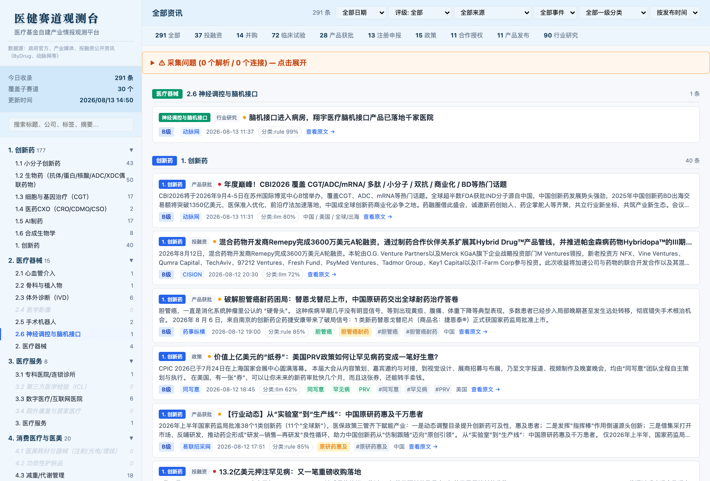

# Healthcare Intelligence Skill

医疗健康行业情报监控 skill：采集 → 三层分类 → Agent 事件结构化 → HTML 看板 → SQLite 情报库 → 日报。

代码与运行数据分离：
- 本目录 = skill 源码，进 Git
- 外部 runtime 目录 = 配置 / 模型 / SQLite / 采集输出，不进 Git

## 功能

- 采集：动脉网 + cnpharm 中国医药报 + ByDrug 179 个来源 + FDA/EMA/PMDA/MHRA/TGA 政府官网
- 分类：三层引擎（规则 → SentenceTransformer 语义 → LLM 兜底），4+1 大类 28 子赛道
- 事件结构化：Agent 识别并去重融资交易 / 监管获批 / 临床研发三类事件（以 Agent 为准，正则只做辅助评分）
- 看板：交互式 HTML，含搜索 / 筛选 / 分类树
- SQLite：文章 / 实体 / 事件 / 信号 结构化存储
- 日报：信号评分 Top 10 + 三类事件富表格

## 预览

看板（HTML 交互式）：



日报（Markdown，三类事件富表格）：

**融资交易事件**

| 日期 | 公司 | 类型 | 轮次/资产 | 金额 | 交易方/投资方 | 赛道 |
|---|---|---|---|---|---|---|
| 2026-08-13 | 虹信生物 | 融资 | B轮 | 数亿元 | 头部资本 | 创新药 |
| 2026-08-12 | 荣昌生物 | 合作授权 | 双抗 | 56亿美元 | 艾伯维 | 创新药 |
| 2026-08-12 | 威高血净 | 收购 | 威高普瑞 | 85亿元 | 威高股份 | 医疗器械 |

**监管获批事件**

| 日期 | 公司 | 产品 | 适应症 | 监管机构 | 决定 |
|---|---|---|---|---|---|
| 2026-08-12 | 康方生物 | 依沃西单抗 | 非小细胞肺癌 | NMPA | 获批上市 |
| 2026-08-11 | ITM/远大医药 | ITM-11 | 神经内分泌肿瘤 | FDA | 拒绝 |

**临床研发事件**

| 日期 | 公司/申办方 | 资产 | 阶段 | 状态/数据 |
|---|---|---|---|---|
| 2026-08-12 | 正大天晴 | TQB2934 | III期 | 进入III期注册临床 |
| 2026-08-12 | 士泽生物 | 通用细胞治疗 | I期 | 完成全部参与者入组 |

## 快速开始

```bash
# 1. 初始化
python3 scripts/healthcare_intelligence.py init --workspace <runtime-dir>

# 2. 按提示逐项配置（来源/时间窗口/运行方式/推送/模型/保留周期）
python3 scripts/healthcare_intelligence.py configure \
  --config <runtime-dir>/config.yaml --set collection_window_hours=48

# 3. 确认配置
python3 scripts/healthcare_intelligence.py setup-status \
  --config <runtime-dir>/config.yaml
python3 scripts/healthcare_intelligence.py finalize-setup \
  --config <runtime-dir>/config.yaml --confirmed-by-user

# 4. （可选）下载分类模型（~118 MB，1–5 分钟）
python3 scripts/healthcare_intelligence.py download-model --runtime <runtime-dir>

# 5. 采集 + 分类
python3 scripts/dashboard_scraper.py \
  --data-dir <runtime-dir>/data/$(date +%Y-%m-%d) \
  --start "2026-08-11 09:00" --end "2026-08-13 09:00"
```

采集完成后，由 Agent 自身 LLM 读取 `dashboard-data.json`，识别并去重三类事件，写入 `data/YYYY-MM-DD/events.json`（见 [SKILL.md](SKILL.md) 的事件 schema），然后：

```bash
# 6. SQLite 入库 + 信号评分 + 日报重渲染
python3 scripts/ingest_events.py \
  --events <runtime-dir>/data/YYYY-MM-DD/events.json \
  --input <runtime-dir>/data/YYYY-MM-DD/dashboard-data.json \
  --runtime-root <runtime-dir>

# 7. 生成看板
python3 scripts/generate_dashboard.py \
  <runtime-dir>/data/YYYY-MM-DD \
  <runtime-dir>/dashboard.html
```

## 产出文件

```
<runtime-dir>/data/YYYY-MM-DD/
├── collected.txt          # 结构化 Markdown
├── dashboard-data.json    # 采集原始 JSON
├── events.json            # Agent 抽取的结构化事件（融资/监管/临床）
└── errors.txt             # 错误日志

<runtime-dir>/intelligence/
└── healthcare_intelligence.sqlite3

<runtime-dir>/reports/
└── healthcare_daily_YYYY-MM-DD.md
```

## 脚本

| 脚本 | 作用 |
|---|---|
| `healthcare_intelligence.py` | 配置管理：init / configure / setup-status / finalize-setup / download-model |
| `dashboard_scraper.py` | 采集 + 三层分类 → `data/YYYY-MM-DD/` |
| `ingest_events.py` | 合并 Agent 事件 + SQLite 入库 + 信号评分 + 日报重渲染 |
| `daily_intelligence.py` | 入库/评分/渲染引擎（`process_payload`，被 `ingest_events.py` 调用） |
| `generate_dashboard.py` | JSON → HTML 交互看板 |
| `classification_engine.py` | 规则→语义→LLM 三层分类引擎 |

## 依赖

```bash
pip install sentence-transformers  # 语义分类层（可选，不装则只用规则+LLM）
```

模型首次使用需下载（`download-model` 命令），约 118 MB，存于 `<runtime>/models/`。跳过则分类降级为关键词规则 + LLM 兜底。

## 测试

```bash
python3 scripts/test_classification_engine.py -v
python3 scripts/test_dashboard_scraper.py -v
python3 scripts/test_daily_intelligence.py -v
```

Agent 执行入口见 [SKILL.md](SKILL.md)。
